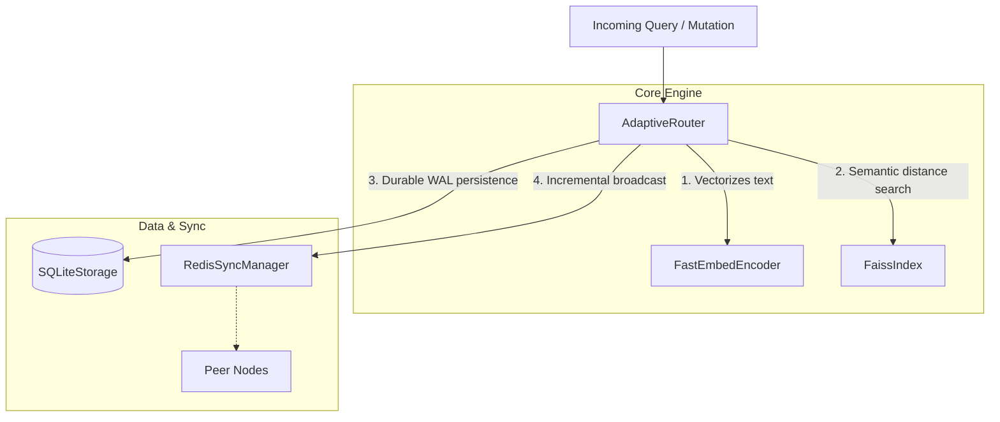

# Contributing to SynaptoRoute

SynaptoRoute uses explicit architecture, verification, and evidence gates so
changes remain reviewable and published claims remain reproducible.

## 1. Development Flow

Before writing any code, your feature must pass through three explicit gates:

1. **Architecture First:** Propose your architectural design, explicitly listing what boundaries are impacted, which subsystems handle the data, and potential concurrency hazards. Do not write code until the architecture is accepted.
2. **Implementation Second:** Write the feature. The codebase enforces strict separation of concerns. Do not mix background worker execution code with API routing code.
3. **Verification Third:** A change is not complete until the relevant tests
   pass. Performance claims additionally require benchmark evidence.

## 2. System Architecture Context

When proposing architectural changes (Step 1 above), you must specify which of the following boundaries your feature modifies. Do not blur the lines between these subsystems.



For detailed ownership and failure modes of these components, you **must** read [ARCHITECTURE.md](docs/ARCHITECTURE.md) before writing code.

## 3. Benchmark Standards

Research experiments must also follow
[`docs/RESEARCH_PROTOCOL.md`](docs/RESEARCH_PROTOCOL.md).

Any pull request that attempts to alter the performance profile of the system (latency, throughput, or accuracy) must provide empirical proof.

* **Reproducible Benchmarks:** Your PR must include the python script located in `scratch/` or `benchmarks/` used to verify your claims.
* **Benchmark Manifests (MANDATORY):** All future benchmarks must generate a schema-valid manifest plus raw logs. Without this evidence, the claim cannot reach `verified` status.
  
  **Required Schema:**
  ```json
  {
    "schema_version": 1,
    "benchmark": "banking77_accuracy",
    "status": "verified",
    "timestamp_utc": "2026-06-04T00:00:00Z",
    "git_commit": "a1b2c3d4",
    "command": ["python", "benchmarks/run_banking77.py"],
    "environment": {
      "python_version": "3.12.10",
      "platform": "Windows 11",
      "cpu": "AMD Ryzen 9 7950X",
      "gpu": "none"
    },
    "dataset": "Banking77 Test Split",
    "metrics": {"accuracy": 91.16},
    "evidence": {
      "script_path": "benchmarks/run_banking77.py",
      "raw_output_path": "benchmarks/raw/banking77.log",
      "timing_unit": "not applicable",
      "notes": "Full split and seed documented in raw output."
    }
  }
  ```
* **Hardware Disclosure:** You must document the exact CPU, GPU, OS, and RAM profile used during the run (included in the manifest above).
* **Dataset Disclosure:** You must cite the dataset used. Random vectors are acceptable for structural latency tests, but are strictly forbidden for accuracy measurements.

## 4. Regression Testing

Concurrency, persistence, and synchronization defects require focused
regression coverage.

**Rule:** Every bug fix must include an automated regression test under
`tests/` that reproduces the original failure mode.

* **Why?** A distributed, multi-threaded routing engine is highly susceptible to race conditions. Without regression testing, a well-meaning refactor in a downstream release could silently resurrect a broadcast storm or a FAISS memory leak. Your test must assert that the failure *does not* happen on the current code path.

## 5. Documentation Standards

Documentation in SynaptoRoute is not marketing copy. It is an engineering ledger.

* **Evidence-Backed Claims:** If you write "the system achieves 95% accuracy", you must explicitly link that claim to a benchmark script and its logged registry in `docs/BENCHMARK_REGISTRY.md`.
* **Honesty Over Numbers:** If a test performs poorly, document it. We do not cherry-pick parameters to inflate benchmark scores. Missing evidence is considered a severe documentation flaw.

Before submitting your PR, review the [LIMITATIONS.md](LIMITATIONS.md) to ensure your implementation does not violate our verified boundaries.
