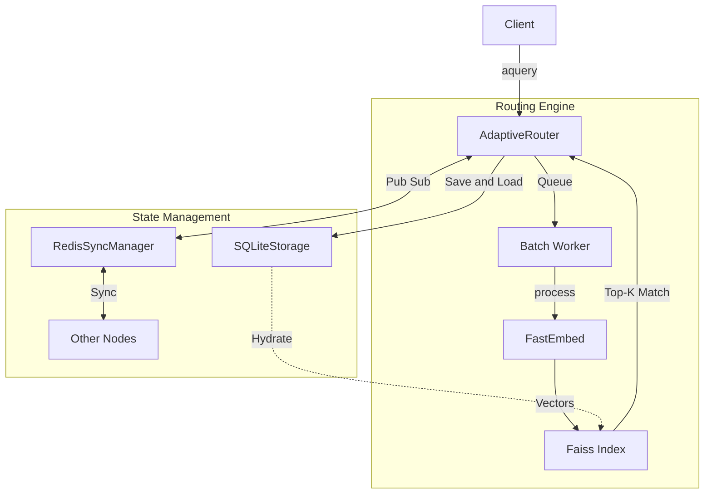

# Contributing to SynaptoRoute

Thank you for considering contributing to SynaptoRoute. This repository enforces strict architectural and linguistic guidelines to maintain professional, objective engineering standards.

## Architecture Overview



## Development Setup

1. **Fork the repository** on GitHub.
2. **Clone your fork** locally:
   ```bash
   git clone https://github.com/YOUR-USERNAME/SynaptoRoute.git
   cd SynaptoRoute
   ```
3. **Create a virtual environment and install dependencies:**
   ```bash
   python -m venv venv
   source venv/bin/activate  # On Windows use `venv\Scripts\activate`
   pip install -e .[api]
   pip install pytest
   ```

## Running Tests
We enforce strict testing for all architectural components (encoding, latency, and threshold boundary accuracy). Before submitting a PR, ensure all tests pass:
```bash
python -m pytest tests/ -v
```

## Language and Documentation Guidelines
To maintain academic and professional engineering standards, contributors must adhere to the following linguistic rules in PRs, commit messages, and documentation:
1. **Objective Terminology:** Avoid hyperbolic marketing terms (e.g., "blazingly," "enterprise-grade"). Do not use the word "proven" unless accompanied by a formal proof. Describe exactly what the code does.
2. **Sanitized Ecosystem Vocabulary:** SynaptoRoute is a semantic microservice router. Do not refer to "AI," "agents," "subagents," or "bots." Refer to external endpoints specifically by their structural function (e.g., "text completion endpoints", "remote embedding models").
3. **Commit Messages:** Use strictly professional git conventions (e.g., `feat: ...`, `fix: ...`).

## Pull Request Process
1. Ensure your code strictly adheres to the existing architectural philosophy (e.g., preserving $O(1)$ updates and non-blocking asynchronous execution).
2. Update `README.md` and `docs/BENCHMARKS.md` if your code impacts structural throughput.
3. Open a Pull Request using the provided GitHub PR template.
4. Wait for CI/CD checks to pass.
