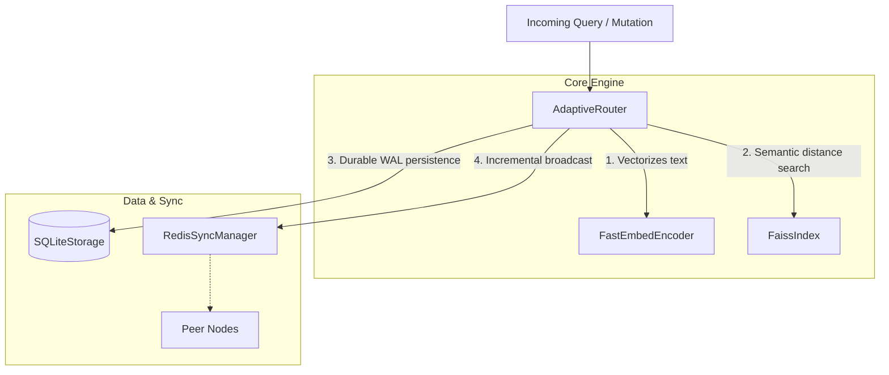

# Contributing to SynaptoRoute

SynaptoRoute operates under an extremely rigid set of engineering principles. To maintain the project's reliability and architectural honesty, all contributors must strictly adhere to the following workflows.

## 1. Development Flow

Before writing any code, your feature must pass through three explicit gates:

1. **Architecture First:** Propose your architectural design, explicitly listing what boundaries are impacted, which subsystems handle the data, and potential concurrency hazards. Do not write code until the architecture is accepted.
2. **Implementation Second:** Write the feature. The codebase enforces strict separation of concerns. Do not mix background worker execution code with API routing code.
3. **Verification Third:** Your code is not considered complete until it is empirically verified by both benchmark tests and regression suites.

## 2. System Architecture Context

When proposing architectural changes (Step 1 above), you must specify which of the following boundaries your feature modifies. Do not blur the lines between these subsystems.



For detailed ownership and failure modes of these components, you **must** read [ARCHITECTURE.md](docs/ARCHITECTURE.md) before writing code.

## 3. Benchmark Standards

Any pull request that attempts to alter the performance profile of the system (latency, throughput, or accuracy) must provide empirical proof.

* **Reproducible Benchmarks:** Your PR must include the python script located in `scratch/` or `benchmarks/` used to verify your claims.
* **Benchmark Manifests (MANDATORY):** All future benchmarks must natively generate and commit a raw output `.json` manifest into the `benchmarks/manifests/` directory. Without this manifest, the claim cannot reach `[VERIFIED]` status.
  
  **Required Schema:**
  ```json
  {
    "benchmark": "Banking77",
    "date": "2026-06-04",
    "commit": "a1b2c3d4",
    "cpu": "AMD Ryzen 9 7950X",
    "dataset": "Banking77 Test Split",
    "accuracy": 91.16
  }
  ```
* **Hardware Disclosure:** You must document the exact CPU, GPU, OS, and RAM profile used during the run (included in the manifest above).
* **Dataset Disclosure:** You must cite the dataset used. Random vectors are acceptable for structural latency tests, but are strictly forbidden for accuracy measurements.

## 3. Regression Testing

SynaptoRoute has survived devastating concurrency and sync loop bugs. We ensure they stay dead.

**Rule:** Every bug fix must include an automated regression test added to `scratch/run_regression_suite.py`.

* **Why?** A distributed, multi-threaded routing engine is highly susceptible to race conditions. Without regression testing, a well-meaning refactor in a downstream release could silently resurrect a broadcast storm or a FAISS memory leak. Your test must assert that the failure *does not* happen on the current code path.

## 4. Documentation Standards

Documentation in SynaptoRoute is not marketing copy. It is an engineering ledger.

* **Evidence-Backed Claims:** If you write "the system achieves 95% accuracy", you must explicitly link that claim to a benchmark script and its logged registry in `docs/BENCHMARK_REGISTRY.md`.
* **Honesty Over Numbers:** If a test performs poorly, document it. We do not cherry-pick parameters to inflate benchmark scores. Missing evidence is considered a severe documentation flaw.

Before submitting your PR, review the [LIMITATIONS.md](LIMITATIONS.md) to ensure your implementation does not violate our verified boundaries.
