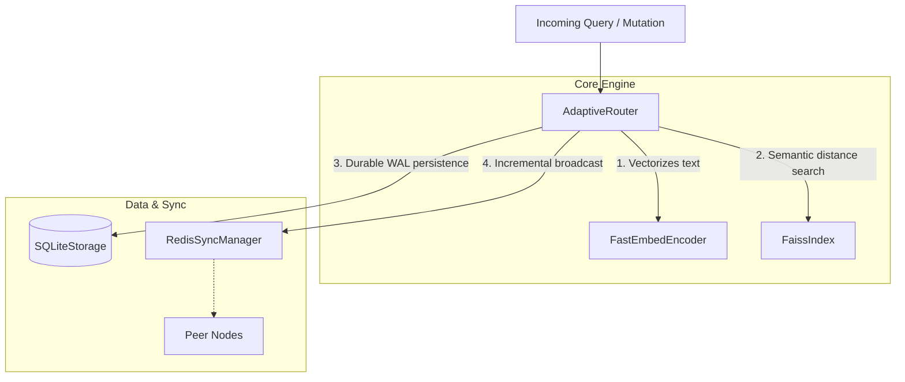

# SynaptoRoute

SynaptoRoute is an adaptive, high-throughput semantic router. It is **not** a large language model (LLM), an embedding model, or a conversational agent. It is a highly optimized control plane that ingests natural language queries and deterministically routes them to predefined system actions ("routes") based on semantic similarity.

It is designed to sit at the edge of your infrastructure, intercepting user intents in milliseconds to bypass heavy LLM generation where predefined workflows (e.g., billing, password resets, API lookups) exist.

## Features

### [VERIFIED] Core Routing Engine
* **High-Throughput Encoding:** Utilizes `FastEmbedEncoder` for zero-overhead vector generation (~130 RPS limit on single core CPU).
* **Deterministic Matching:** Leverages localized FAISS (IndexFlatIP) indices for strictly mathematical distance measurements.
* **Dynamic Mutation:** Routes can be added, updated, and deleted in memory without restarting the router, safely executing under heavy load.
* **Persistent Storage:** Backed by SQLite WAL indexing, providing instantaneous state recovery.

### [EXPERIMENTAL] Distributed Synchronization
* **Redis PubSub Topology:** Nodes share semantic state mutations across a Redis cluster using event broadcasting. 
* *Constraint:* Fully eventual consistency. O(N×M) network bottlenecks during cold-boot limits safe scaling to smaller multi-node enterprise deployments.

### [PLANNED] Out-of-Distribution (OOD) Resilience
* **Cross-Encoder Fallbacks:** Intelligent deferral to dense reasoning models when a query falls between semantic boundaries.
* **Dynamic Threshold Fitting:** Auto-calibrating confidence margins based on active false-positive rates.

## Architecture Design

SynaptoRoute separates concerns across strict boundary layers to guarantee stability under concurrent loads:

For a detailed breakdown of subsystem ownership, dependencies, and failure modes, refer to the [Architecture Documentation](docs/ARCHITECTURE.md).

---

## Performance Claims

SynaptoRoute bases its claims strictly on automated, reproducible telemetry located in [BENCHMARK_REGISTRY.md](docs/BENCHMARK_REGISTRY.md) and benchmark manifests.

* **Accuracy:** ~91.16% on Banking77, ~92.0% on CLINC150 (Top-1 Accuracy).
* **Latency:** 3.0ms median retrieval latency on 100,000 route indices. *(Note: Early v0.3.0 claims of 0.003ms have been fully retracted due to a telemetry unit conversion bug).*

For a deep dive into the methodology, datasets, and hardware used for these measurements, consult [BENCHMARKS.md](BENCHMARKS.md).

---

## Engineering Integrity (Trust & Verification)

SynaptoRoute follows a philosophy of uncompromising engineering rigor. During the v0.3.0 architectural transition, independent benchmark audits uncovered invalid concurrency artifacts and a devastating telemetry unit conversion bug regarding latency claims.

As a result:
* The prior benchmark numbers were formally retracted.
* The benchmarking scripts were heavily audited and corrected.
* An exhaustive suite of regression tests was introduced (`scratch/run_regression_suite.py`) to prevent concurrent map mutations, broadcast loops, and FAISS overwriting leaks from ever returning.
* A strict [BENCHMARK_REGISTRY.md](docs/BENCHMARK_REGISTRY.md) was created to hold the unalterable truth of our telemetry.

Mistakes in open source are inevitable, but hiding them is unacceptable. We preserve our retracted mistakes historically to demonstrate the mathematical rigor required to build a trusted distributed router.

---

## Production Readiness

SynaptoRoute v0.4.0 is structurally sound and mathematically honest. 

* **Single-Node Deployments:** **SAFE FOR PRODUCTION**. Local SQLite and FAISS memory boundaries are fully concurrent-safe, handling unbounded queue bursts with graceful fail-fast logic.
* **Multi-Node Deployments (Small Scale):** **SAFE FOR STAGING**. Redis sync operates properly for incremental live updates without broadcast loops.
* **Enterprise-Scale Deployments (>5 nodes, >100k routes):** **NOT SUPPORTED**. The Redis PubSub architecture initiates `O(N×M)` broadcast storms during cluster bootstrapping. This will be replaced by Litestream/durable external storage in a future release.

## Developer Resources

* **[CONTRIBUTING.md](CONTRIBUTING.md):** Rules for merging code, tests, and benchmark verifications.
* **[ROADMAP.md](ROADMAP.md):** Current status of our research, infrastructure, and engineering goals.
* **[BENCHMARKS.md](BENCHMARKS.md):** Methodology and deep-dive telemetry.
* **[LIMITATIONS.md](LIMITATIONS.md):** A brutally honest assessment of where the framework falls short.
* **[COMPARISON.md](COMPARISON.md):** Objective, measured reviews of alternatives like Semantic Router.
* **[ARCHITECTURE.md](docs/ARCHITECTURE.md):** Subsystem ownership and failure domains.
