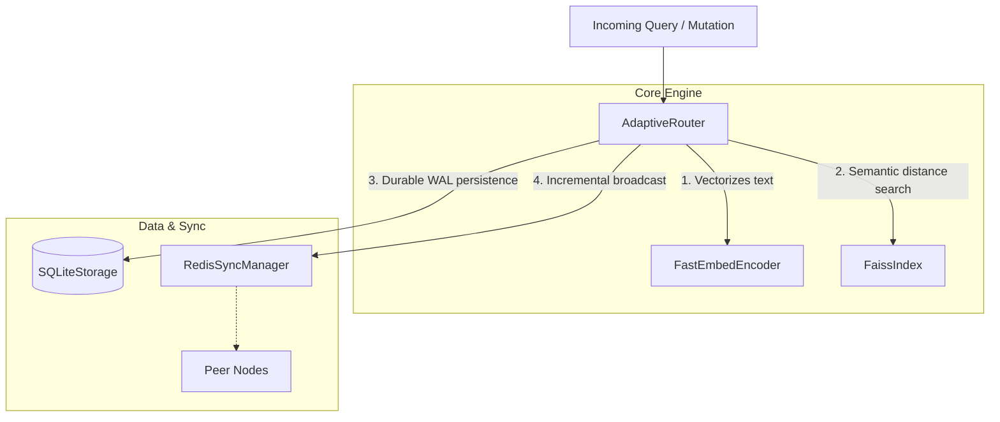

<div align="center">
  <h1>🧠 SynaptoRoute</h1>
  <p><strong>A blazing-fast, high-throughput semantic router for AI agents and LLM applications.</strong></p>

  [](https://www.python.org/downloads/)
  [](https://opensource.org/licenses/MIT)
  []()
</div>

---

## What is SynaptoRoute?

SynaptoRoute is an ultra-fast control plane that sits at the edge of your infrastructure. It intercepts natural language queries from users and **deterministically routes them** to predefined tools, APIs, or workflows based on semantic meaning. 

**It is not an LLM.** It is a mathematical routing engine.

Instead of paying for expensive, slow LLM generations just to figure out what a user wants, SynaptoRoute mathematically calculates the user's intent in **milliseconds** using local embeddings. If the user wants to check their billing, SynaptoRoute instantly triggers the billing workflow—bypassing the LLM entirely.

## ⚡ Why use SynaptoRoute?

* **Insanely Fast:** ~3.0ms median retrieval latency on 100,000 routes. 
* **Zero-Cost Routing:** By default, it uses `FastEmbedEncoder` to generate vectors locally on your CPU. No API calls, no token costs.
* **Dynamically Mutable:** Add, update, or delete routes in memory in real-time without restarting your server.
* **Bulletproof Persistence:** All routing logic is instantly persisted to an embedded SQLite database using Write-Ahead Logging (WAL) to guarantee zero data loss.
* **Agent Framework Ready:** Native integrations for LangChain and LlamaIndex to use as a smart tool-selector.

---

## 🚀 Quickstart

### Installation

```bash
pip install synaptoroute
```

### 1-Minute Example

```python
import asyncio
from synaptoroute import AdaptiveRouter, Route

async def main():
    # 1. Initialize the router (automatically uses local FastEmbed models)
    router = AdaptiveRouter()
    
    # 2. Define your workflows (routes)
    billing_route = Route(
        name="billing_inquiry",
        utterances=["how much do I owe?", "view my invoice", "payment history"],
        threshold=0.85
    )
    password_route = Route(
        name="password_reset",
        utterances=["I forgot my password", "reset password", "can't log in"],
        threshold=0.85
    )
    
    # 3. Add routes and start the engine
    router.add_route(billing_route)
    router.add_route(password_route)
    await router.start()
    
    # 4. Route incoming user queries in milliseconds
    match = await router.aquery("Where is my latest bill?")
    
    if match and match.name == "billing_inquiry":
        print("Triggering the Billing Workflow! 💸")
    else:
        print("Falling back to standard LLM generation...")

asyncio.run(main())
```

---

## 🏗️ How it Works (Architecture)

SynaptoRoute separates concerns across strict boundary layers to guarantee stability under concurrent load:



For a detailed breakdown of subsystem ownership and failure modes, refer to the [Architecture Documentation](docs/ARCHITECTURE.md).

---

## 🛡️ Engineering Integrity & Transparency

We believe in uncompromising engineering rigor. Mistakes in open source are inevitable, but hiding them is unacceptable.

* **Mathematical Honesty:** Our performance claims are strictly based on automated, reproducible telemetry located in [BENCHMARK_REGISTRY.md](docs/BENCHMARK_REGISTRY.md). 
* **Safe for Production:** Single-node deployments (local SQLite and FAISS memory boundaries) are fully concurrent-safe and production-ready.
* **Distributed Sync Limitations:** Enterprise-scale distributed deployments (>5 nodes) using Redis PubSub currently suffer from O(N×M) network bottlenecks during cold-boot. We recommend standard multi-node deployments for staging only until our Durable Ledger upgrade is released.

## 📚 Developer Resources

* **[CONTRIBUTING.md](CONTRIBUTING.md):** Rules for merging code and tests.
* **[ROADMAP.md](ROADMAP.md):** Status of our research and engineering goals.
* **[BENCHMARKS.md](BENCHMARKS.md):** Methodology and deep-dive telemetry.
* **[LIMITATIONS.md](LIMITATIONS.md):** A brutally honest assessment of where the framework falls short.
* **[COMPARISON.md](COMPARISON.md):** Objective reviews of alternatives like Semantic Router.
* **[ARCHITECTURE.md](docs/ARCHITECTURE.md):** Subsystem ownership and failure domains.
