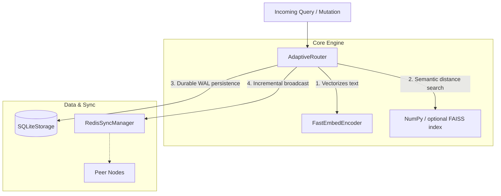

# SynaptoRoute

SynaptoRoute is an adaptive, high-throughput semantic router. It is **not** a large language model (LLM), an embedding model, or a conversational agent. It is a highly optimized control plane that ingests natural language queries and deterministically routes them to predefined system actions ("routes") based on semantic similarity.

It is designed to sit at the edge of your infrastructure, intercepting user intents in milliseconds to bypass heavy LLM generation where predefined workflows (e.g., billing, password resets, API lookups) exist.

## Features

### Core Routing Engine
* **Local Encoding:** Utilizes `FastEmbedEncoder` for local vector generation.
* **Deterministic Matching:** Supports NumPy exact retrieval and optional
  FAISS HNSW retrieval behind the same routing contract.
* **Dynamic Mutation:** Routes can be added, updated, and deleted in memory without restarting the router, safely executing under heavy load.
* **Persistent Storage:** Backed by SQLite storage with explicit in-memory and
  durable mutation acknowledgements, observable receipts, and restart recovery.
* **Observable Decisions:** `AdaptiveRouter.match()` returns the selected
  route, score, margin, ranked candidates, and an explicit decision reason;
  the callable API remains backward compatible.

### [EXPERIMENTAL] Distributed Synchronization
* **Redis PubSub Topology:** Nodes share semantic state mutations across a Redis cluster using event broadcasting. 
* *Constraint:* Fully eventual consistency. O(N*M) network bottlenecks during cold-boot limits safe scaling to smaller multi-node enterprise deployments.

### [IN PROGRESS] Out-of-Distribution (OOD) Resilience
* **Cross-Encoder Fallbacks:** Intelligent deferral to dense reasoning models when a query falls between semantic boundaries.
* **Validation-Only Calibration:** The research harness fits global and
  route-specific score thresholds plus an ambiguity margin on held-out data,
  then freezes the policy before test evaluation. These policies are research
  features, not a guarantee of OOD safety.

## Architecture Design

SynaptoRoute separates concerns across strict boundary layers to guarantee stability under concurrent loads:

For a detailed breakdown of subsystem ownership, dependencies, and failure modes, refer to the [Architecture Documentation](docs/ARCHITECTURE.md).

---

## Performance Claims

SynaptoRoute now treats historical benchmark numbers as audit targets until they are rerun with schema-valid manifests and raw logs.

* **Accuracy:** Banking77 and CLINC150 numbers are currently unverified historical claims.
* **Latency:** The old `0.003ms` claim is retracted. The corrected interpretation is about `3ms`, but it still requires a clean rerun before publication.
* **Research candidates:** Five-seed quality and structural systems runs now
  have clean local replications, but remain unverified until artifacts are
  archived and independently reproduced.

For a deep dive into the methodology, datasets, and hardware used for these measurements, consult [BENCHMARKS.md](BENCHMARKS.md).

---

## Engineering Integrity (Trust & Verification)

SynaptoRoute follows a philosophy of uncompromising engineering rigor. During the v0.3.0 architectural transition, independent benchmark audits uncovered invalid concurrency artifacts and a devastating telemetry unit conversion bug regarding latency claims.

As a result:
* Historical benchmark claims are now marked `unverified` or `retracted` unless the evidence is complete.
* A schema-validated benchmark runner records commands, environment metadata, and raw log paths.
* A strict [BENCHMARK_REGISTRY.md](docs/BENCHMARK_REGISTRY.md) tracks what can and cannot be claimed.

Mistakes in open source are inevitable, but hiding them is unacceptable. We preserve our retracted mistakes historically to demonstrate the mathematical rigor required to build a trusted distributed router.

---

## Production Readiness

SynaptoRoute v0.4.0 should be treated as an active engineering project, not a finished research artifact.

* **Single-Node Deployments:** plausible target, but release claims require passing tests and verified benchmark evidence.
* **Multi-Node Deployments:** Redis sync is experimental and should be used only for staged validation.
* **Enterprise-Scale Deployments (>5 nodes, >100k routes):** **NOT SUPPORTED**. Redis Pub/Sub bootstrap behavior is not validated for massive cluster state transfer.

## Developer Resources

* **[CONTRIBUTING.md](CONTRIBUTING.md):** Rules for merging code, tests, and benchmark verifications.
* **[ROADMAP.md](ROADMAP.md):** Current status of our research, infrastructure, and engineering goals.
* **[PROJECT_IMPROVEMENT_ROADMAP.md](docs/PROJECT_IMPROVEMENT_ROADMAP.md):** Competitive analysis and next PR sequence.
* **[RESEARCH_PROTOCOL.md](docs/RESEARCH_PROTOCOL.md):** Research questions, datasets, baselines, metrics, statistics, and evidence gates.
* **[DEVELOPMENT_PILOT_RESULTS.md](docs/DEVELOPMENT_PILOT_RESULTS.md):** Explicitly unverified Banking77 and CLINC150 pilot results, including negative findings.
* **[MULTISEED_DIAGNOSTIC_RESULTS.md](docs/MULTISEED_DIAGNOSTIC_RESULTS.md):** Five-seed full-test diagnostics, paired intervals, and the static-quality decision.
* **[CLEAN_REPLICATION_RESULTS.md](docs/CLEAN_REPLICATION_RESULTS.md):** Clean-commit commands, outcomes, artifact digests, and the remaining promotion gate.
* **[BENCHMARKS.md](BENCHMARKS.md):** Methodology and deep-dive telemetry.
* **[LIMITATIONS.md](LIMITATIONS.md):** A brutally honest assessment of where the framework falls short.
* **[COMPARISON.md](COMPARISON.md):** Objective, measured reviews of alternatives like Semantic Router.
* **[ARCHITECTURE.md](docs/ARCHITECTURE.md):** Subsystem ownership and failure domains.
* **[DURABILITY_CONTRACT.md](docs/DURABILITY_CONTRACT.md):** Exact mutation acknowledgement, ordering, failure, and restart guarantees.
