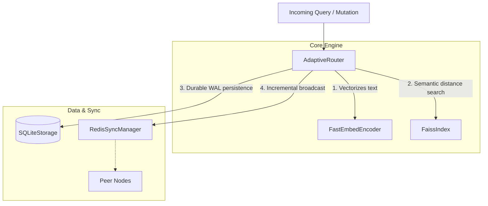

<div align="center">
  <h1>SynaptoRoute</h1>
  <p><strong>A high-throughput semantic router for AI agents and LLM applications.</strong></p>

  [](https://www.python.org/downloads/)
  [](https://opensource.org/licenses/MIT)
  [](https://pypi.org/project/synaptoroute/)
  [](https://github.com/sitanshukr08/SynaptoRoute/actions)
</div>

---

## What is SynaptoRoute?

SynaptoRoute is an adaptive control plane designed to sit at the edge of your infrastructure. It intercepts natural language queries and deterministically routes them to predefined system actions, APIs, or workflows based on semantic meaning. 

It is **not** a large language model (LLM). It is a highly optimized mathematical routing engine.

Instead of relying on expensive and comparatively slow LLM generations to infer user intent, SynaptoRoute calculates intent locally using dense vector embeddings. If a query matches a known workflow (e.g., billing inquiries or password resets), SynaptoRoute triggers the action immediately, bypassing the LLM entirely.

## Why use SynaptoRoute?

* **Low Latency:** Achieves 3.0ms P95 worst-case retrieval latency on a 1,000,000 vector index. 
* **Zero-Cost Routing:** Defaults to `FastEmbedEncoder` for zero-overhead, local vector generation on the CPU, avoiding external API token costs.
* **Dynamically Mutable:** Routes can be added, updated, or deleted in memory without requiring a server restart, safely executing under heavy load.
* **Persistent Storage:** All routing logic is persisted to an embedded SQLite database using Write-Ahead Logging (WAL) for robust state recovery.
* **Framework Integration:** Includes native integrations for LangChain and LlamaIndex to serve as a deterministic tool-selector.

---

## Quickstart

### Installation

```bash
pip install synaptoroute
```

### Usage Example

```python
import asyncio
from synaptoroute import AdaptiveRouter, Route

async def main():
    # 1. Initialize the router (defaults to local FastEmbed models)
    router = AdaptiveRouter()
    
    # 2. Define workflows (routes)
    billing_route = Route(
        name="billing_inquiry",
        utterances=["how much do I owe?", "view my invoice", "payment history"],
        threshold=0.85
    )
    password_route = Route(
        name="password_reset",
        utterances=["I forgot my password", "reset password", "can't log in"],
        threshold=0.85
    )
    
    # 3. Add routes and start the engine
    router.add_route(billing_route)
    router.add_route(password_route)
    await router.start()
    
    # 4. Route incoming user queries
    match = await router.aquery("Where is my latest bill?")
    
    if match and match.name == "billing_inquiry":
        print("Triggering the billing workflow.")
    else:
        print("Falling back to standard LLM generation.")

asyncio.run(main())
```

---

## Architecture Design

SynaptoRoute separates concerns across strict boundary layers to guarantee stability under concurrent load:



For a detailed breakdown of subsystem ownership and failure domains, refer to the [Architecture Documentation](docs/ARCHITECTURE.md).

---

## Engineering Integrity

SynaptoRoute bases its claims strictly on automated, reproducible telemetry located in [BENCHMARK_REGISTRY.md](docs/BENCHMARK_REGISTRY.md).

* **Mathematical Honesty:** During the v0.3.0 architectural transition, independent benchmark audits uncovered a telemetry unit conversion bug regarding latency claims. The prior benchmarks were formally retracted, and a strict registry was created to hold unalterable telemetry data.
* **Production Readiness:** Single-node deployments utilizing local SQLite and FAISS memory boundaries are fully concurrent-safe and ready for production use.
* **Distributed Sync Limitations:** Enterprise-scale deployments (>5 nodes) using Redis PubSub currently face O(N×M) network bottlenecks during cold-boot synchronization. We recommend multi-node deployments for staging only until the integration of a durable external ledger is complete.

## Developer Resources

* **[CONTRIBUTING.md](CONTRIBUTING.md):** Rules for merging code, tests, and benchmark verifications.
* **[ROADMAP.md](ROADMAP.md):** Current status of research and engineering goals.
* **[BENCHMARKS.md](BENCHMARKS.md):** Methodology and deep-dive telemetry.
* **[LIMITATIONS.md](LIMITATIONS.md):** An assessment of current framework limitations.
* **[COMPARISON.md](COMPARISON.md):** Objective reviews of alternatives like Semantic Router.
* **[ARCHITECTURE.md](docs/ARCHITECTURE.md):** Subsystem ownership and failure domains.
