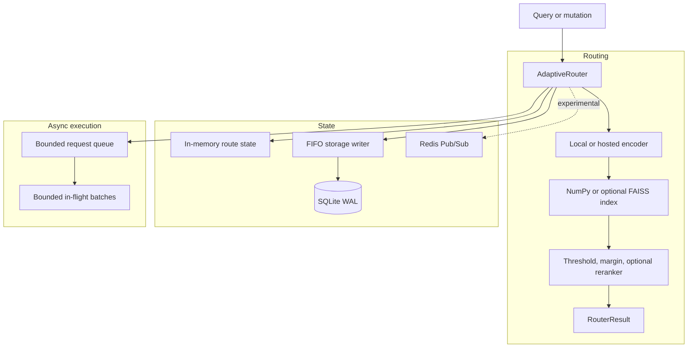

<div align="center">
  <h1>SynaptoRoute</h1>
  <p><strong>A local, persistent semantic router for AI agents and LLM applications.</strong></p>

  [](https://www.python.org/downloads/)
  [](https://opensource.org/licenses/MIT)
  [](https://pypi.org/project/synaptoroute/)
  [](https://github.com/sitanshukr08/SynaptoRoute/actions)
</div>

---

## What Is SynaptoRoute?

SynaptoRoute maps natural-language queries to predefined routes such as tools,
APIs, or workflows. It performs embedding and retrieval locally by default, so
applications can handle known intents without invoking an LLM for every
request.

It is not an LLM, an embedding model, or a security boundary. It is an active
engineering and research project focused on observable decisions, explicit
abstention, dynamic mutation, and local persistence.

## Current Capabilities

* **Local encoding:** `FastEmbedEncoder` is the default CPU encoder.
* **Exact or approximate retrieval:** NumPy exact search is available by
  default; FAISS HNSW is optional.
* **Observable decisions:** `AdaptiveRouter.match()` and `amatch()` return the
  selected route, score, margin, ranked candidates, and decision reason.
* **Backward-compatible routing:** `router(query)` and `aquery(query)` still
  return `Route | None`.
* **Dynamic mutation:** routes and utterances can be added, updated, and
  deleted without restarting the process.
* **Explicit durability:** mutation receipts distinguish memory acceptance,
  durable commit, and failed persistence.
* **Bounded async load:** queue and in-flight batch limits shed excess work
  with an explicit overload error.
* **Experimental distributed sync:** Redis Pub/Sub can broadcast mutations,
  but it does not provide durable replay or strong consistency.

## Quickstart

### Installation

```bash
pip install synaptoroute
```

### Synchronous Routing

```python
from synaptoroute import AdaptiveRouter, Route

router = AdaptiveRouter()
router.add_route(
    Route(
        name="billing_inquiry",
        utterances=["view my invoice", "payment history", "charged twice"],
        threshold=0.80,
    )
)

result = router.match("Where is my latest bill?")
if result.matched:
    print(result.route_name, result.score, result.decision_reason)

router.close()
```

### Asynchronous Routing

```python
import asyncio

from synaptoroute import AdaptiveRouter, Route


async def main():
    router = AdaptiveRouter(max_queue_size=1_000, max_in_flight_batches=4)
    router.add_route(
        Route(
            name="password_reset",
            utterances=["forgot my password", "reset password", "cannot log in"],
            threshold=0.80,
        )
    )

    await router.start()
    try:
        result = await router.amatch("I cannot sign in")
        print(result.route_name, result.score, result.margin)
    finally:
        await router.stop()


asyncio.run(main())
```

## Architecture



See [Architecture Documentation](docs/ARCHITECTURE.md) and the
[Durability Contract](docs/DURABILITY_CONTRACT.md) for ownership, ordering,
and failure semantics.

## Evidence Status

Historical accuracy, OOD, throughput, GPU, and scale claims remain
`unverified` unless a claim-specific evidence manifest says otherwise. The old
`0.003ms` one-million-vector latency claim is retracted because its unit
conversion was wrong.

Five-seed Banking77 and CLINC150/OOS quality studies and structural systems
smokes now have clean local replications. They remain candidate evidence, not
paper evidence, until raw artifacts are archived and independently reproduced.
The static study does not support a broad superior-accuracy claim: per-route
calibration helps CLINC open-set behavior, harms Banking77, and trails logistic
regression on overall CLINC quality.

## Production Readiness

Treat v0.4.1 as an active project rather than a validated production system.

* **Single process:** the primary engineering target; tests cover concurrent
  reads, mutation receipts, restart recovery, and bounded async overload.
* **Multiple processes or nodes:** process-local queues and caches do not
  coordinate across workers.
* **Redis synchronization:** experimental; missed-message replay, ordering,
  and bootstrap behavior are not yet a durable protocol.
* **OOD rejection:** calibrated abstention is available in the research
  harness, but it is not a guarantee against incorrect routing.

## Developer Resources

* [CONTRIBUTING.md](CONTRIBUTING.md): setup, review, and evidence rules.
* [ROADMAP.md](ROADMAP.md): research phases and decision gates.
* [BENCHMARKS.md](BENCHMARKS.md): benchmark commands and metric policy.
* [RESEARCH_PROTOCOL.md](docs/RESEARCH_PROTOCOL.md): fixed questions,
  datasets, baselines, metrics, and statistics.
* [MULTISEED_DIAGNOSTIC_RESULTS.md](docs/MULTISEED_DIAGNOSTIC_RESULTS.md):
  five-seed static results and negative findings.
* [CLEAN_REPLICATION_RESULTS.md](docs/CLEAN_REPLICATION_RESULTS.md): clean-run
  provenance, artifact digests, and the remaining promotion gate.
* [BENCHMARK_REGISTRY.md](docs/BENCHMARK_REGISTRY.md): claim and evidence
  status.
* [LIMITATIONS.md](LIMITATIONS.md): known technical limitations.
* [PROJECT_IMPROVEMENT_ROADMAP.md](docs/PROJECT_IMPROVEMENT_ROADMAP.md):
  competitive context and the longer product backlog.
