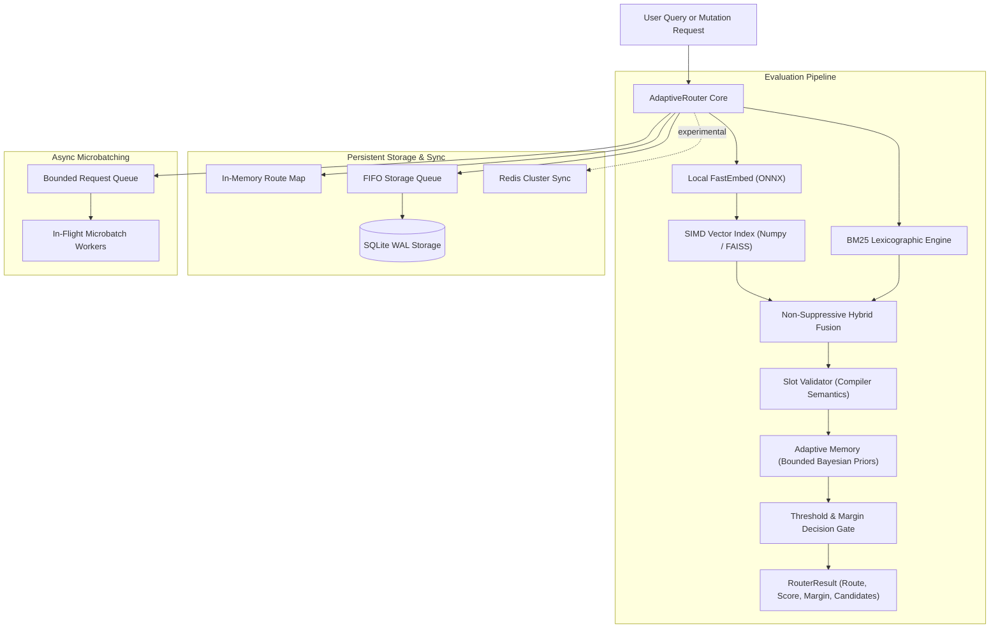
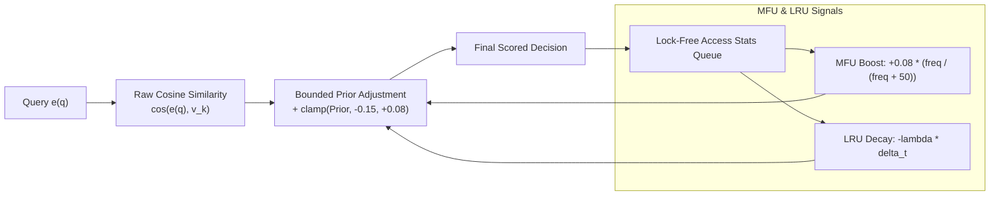

<div align="center">

# SynaptoRoute

### *Local, Persistent & Adaptive Semantic Pre-Routing Engine for AI Agents*

[](https://pypi.org/project/synaptoroute/)
[](https://www.python.org/downloads/)
[](https://github.com/sitanshukr08/SynaptoRoute/actions)
[](https://github.com/astral-sh/ruff)
[](LICENSE)

---

**SynaptoRoute** is a high-throughput, edge-native semantic router that dispatches natural language queries to discrete tool handlers, APIs, or workflow chains locally—eliminating unnecessary, expensive LLM calls for known user intents.

[Quickstart](#quickstart) • [Architecture](#architecture) • [Adaptive Memory](#adaptive-memory-engine) • [Integrations](#framework-integrations) • [CLI](#developer-cli) • [Documentation](#developer-resources)

</div>

---

## Key Highlights

- **Local FastEmbed ONNX Engine:** Runs lightweight vector embeddings locally on CPU using ONNX Runtime—achieving sub-10ms P50 dispatch latencies.
- **Hybrid Lexicographic + Vector Routing:** Fuses log-dampened BM25 keyword scoring with dense cosine similarity for exact-token query precision (IDs, names, rare codes).
- **Compiler Semantics & Slot Constraints:** Declare typed regex slot constraints per route (`order_id`, `amount`). The router validates slots before dispatching—deterministic, zero-ambiguity routing.
- **Durable SQLite WAL Storage:** Persistent state management with non-blocking `MutationReceipt` acknowledgements and explicit `durable_barrier()` disk flushing.
- **Adaptive Memory Engine:** Dynamic MFU/LRU prior adjustments via `BoundedBayesianWeigher`, lock-free access stats logging, and Adaptive Replacement Cache (ARC).
- **Framework Integrations:** Native zero-boilerplate adapters for **LangChain** (`Runnable`) and **LlamaIndex** (`BaseSelector`).
- **Truth-First Benchmarks:** 100% schema-validated benchmark manifests and raw log evidence.
- **Developer CLI (`synaptoroute`):** Built-in terminal CLI for inspecting system capabilities, testing matching rules, and executing benchmark suites.

---

## Quickstart

### Installation

```bash
pip install synaptoroute
```

*Optional extras:*
```bash
pip install "synaptoroute[all]"       # Installs LangChain, LlamaIndex, Redis, OpenAI, and FAISS
pip install "synaptoroute[langchain]" # Installs LangChain integration
pip install "synaptoroute[llamaindex]" # Installs LlamaIndex integration
```

---

### Synchronous Routing

```python
from synaptoroute import AdaptiveRouter, Route

# 1. Initialize AdaptiveRouter (uses FastEmbed ONNX local CPU encoder by default)
router = AdaptiveRouter()

# 2. Register semantic intent routes with example utterances
router.add_route(
    Route(
        name="billing_support",
        utterances=[
            "I need a refund for my order",
            "Where is my invoice or receipt?",
            "Cancel my monthly subscription",
            "My card was charged twice",
        ],
        threshold=0.75,
    )
)

router.add_route(
    Route(
        name="technical_support",
        utterances=[
            "The app crashes on startup",
            "Cannot connect to the database",
            "Getting a 500 internal server error",
            "API request timed out",
        ],
        threshold=0.75,
    )
)

# 3. Match user query
result = router.match("Where can I download my billing receipt?")

if result.matched:
    print(f"Matched Route   : {result.route_name}")
    print(f"Confidence Score: {result.score:.4f}")
    print(f"Decision Reason : {result.decision_reason}")
else:
    print(f"Abstained: {result.decision_reason}")

router.close()
```

---

### Asynchronous Routing with Microbatching

```python
import asyncio
from synaptoroute import AdaptiveRouter, Route

async def main():
    # Bounded queue (1,000 queries) and bounded in-flight batch workers (4)
    router = AdaptiveRouter(max_queue_size=1000, max_in_flight_batches=4)
    
    router.add_route(
        Route(
            name="password_reset",
            utterances=["forgot password", "reset login password", "locked out of account"],
            threshold=0.75,
        )
    )

    await router.start()
    try:
        # Non-blocking concurrent async query evaluation
        result = await router.amatch("How do I reset my password?")
        print(f"Async Matched: {result.route_name} (Score: {result.score:.4f})")
    finally:
        await router.stop()

asyncio.run(main())
```

---

### Hybrid BM25 & Compiler-Style Slot Constraints

```python
from synaptoroute import AdaptiveRouter, Route

# Enable BM25 lexicographic signal fusion and compiler-style slot matching
router = AdaptiveRouter(
    enable_hybrid_lexicon=True,  # Fuses log-dampened BM25 with cosine similarity
    hybrid_alpha=0.3,            # 30% vector weight, 70% BM25 keyword weight
    enable_slot_matching=True,   # Rejects candidate if required typed slots are missing
)

router.add_route(
    Route(
        name="refund_request",
        utterances=["I want a refund for my order", "process return"],
        slots={"order_id": r"#?\b\d{4,}\b"},  # Order ID pattern required
        threshold=0.70,
    )
)

# Query matching both intent and slot constraint -> MATCHED_HYBRID
res = router.match("Refund order #8821 please")
print(res.route_name, res.decision_reason)  # refund_request, matched_hybrid
```

---

## Architecture

SynaptoRoute decouples query evaluation from storage persistence. In-memory SIMD vector matrices process query evaluations under a writer-priority reader/writer lock (`RWLock`), while a dedicated FIFO background worker streams mutation writes to an SQLite WAL database.



---

## Adaptive Memory Engine

SynaptoRoute introduces **Adaptive Memory Semantic Routing (AMSR)**—replacing rigid, static vector matching with dynamic Bayesian prior adjustments based on usage frequency (MFU) and temporal recency (LRU).



### Enabling Adaptive Memory

```python
from synaptoroute import AdaptiveRouter, Route, SQLiteStorage

router = AdaptiveRouter(
    storage=SQLiteStorage("routes.sqlite3"),
    enable_adaptive_memory=True  # Enables Bounded Bayesian Prior scoring
)

router.add_route(Route(name="billing", utterances=["payment failed", "refund"]))

# Matching queries automatically records hits and adapts candidate scores in real-time
result = router.match("refund status")
print(result.route_name, result.score)

router.close()
```

Read the full research paper specification: **[docs/RESEARCH_ADAPTIVE_MEMORY_ROUTING.md](docs/RESEARCH_ADAPTIVE_MEMORY_ROUTING.md)**.

---

## Framework Integrations

### LangChain Integration

```python
from synaptoroute import AdaptiveRouter, Route
from examples.langchain_router import SynaptoRouteLangChainAdapter

router = AdaptiveRouter()
router.add_route(Route(name="account_management", utterances=["change email", "delete account"]))

adapter = SynaptoRouteLangChainAdapter(router)
output = adapter.invoke({"input": "I need to update my email address"})
print(output["route"], output["score"])
```

### LlamaIndex Integration

```python
from synaptoroute import AdaptiveRouter, Route
from examples.llamaindex_selector import SynaptoRouteLlamaIndexSelector

router = AdaptiveRouter()
router.add_route(Route(name="sql_analytics_engine", utterances=["total revenue q3", "user churn rate"]))

selector = SynaptoRouteLlamaIndexSelector(router)
selections = selector.select("Calculate total revenue for Q3")
print(selections[0]["route_name"])
```

---

## Developer CLI

SynaptoRoute includes a built-in terminal CLI tool for diagnostics, interactive testing, and benchmarking:

```bash
# Print system environment, Python runtime, and ONNX encoder status
synaptoroute info

# Test query matching directly from terminal
synaptoroute match "Where is my latest billing invoice?"

# Execute the self-contained CI verified benchmark suite
synaptoroute benchmark
```

---

## Project Positioning & Safety Boundaries

SynaptoRoute is designed specifically as a **local, persistent semantic pre-routing layer**.

* **What it IS:** An edge-native pre-routing dispatch library for routing known user intents to tool handlers or workflow chains.
* **What it IS NOT:** It is not an LLM, a generative model, a security authorization boundary, or a prompt injection barrier. Security authorization and input validation must be enforced downstream by target tool handlers.

---

## Developer Resources

- 📖 **[Public API Reference](docs/API_REFERENCE.md):** Complete technical reference for all classes, methods, and exceptions.
- 🔬 **[Adaptive Memory Research Paper](docs/RESEARCH_ADAPTIVE_MEMORY_ROUTING.md):** Mathematical formulation and metric topology proofs.
- 📋 **[Changelog](CHANGELOG.md):** Version history and feature updates.
- 🛡️ **[Security Policy](SECURITY.md):** Security boundaries and disclosure process.
- 🤝 **[Code of Conduct](CODE_OF_CONDUCT.md):** Community standards.
- 🛠️ **[Contributing Guide](CONTRIBUTING.md):** Setup, testing, and pull request guidelines.
- 📐 **[Architecture Overview](docs/ARCHITECTURE.md):** Deep-dive into concurrency and storage lock hierarchy.
- ⚡ **[Durability Contract](docs/DURABILITY_CONTRACT.md):** Mutation receipt state transitions and barrier guarantees.

---

<div align="center">

*SynaptoRoute is licensed under the [MIT License](LICENSE).*

</div>
