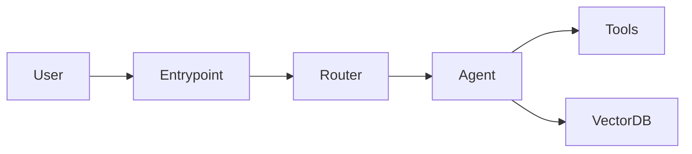
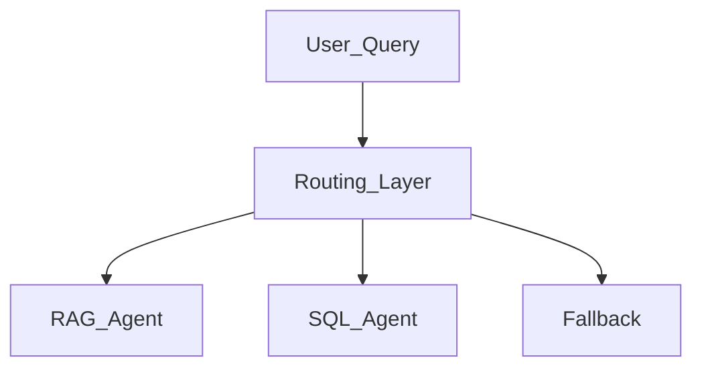
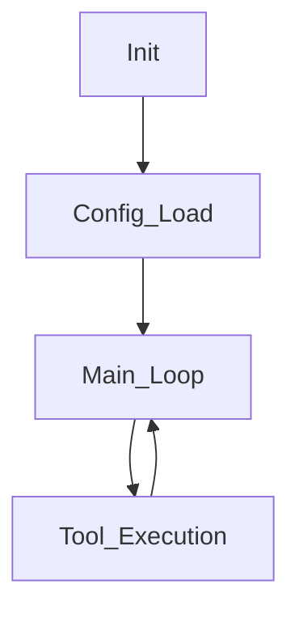

# Architecture Report

## Dependency Graph

```mermaid
graph TD
    synaptoroute_encoder --> synaptoroute_exceptions
    synaptoroute_reranker --> synaptoroute_models
    synaptoroute_router --> synaptoroute_index
    synaptoroute_router --> synaptoroute_exceptions
    synaptoroute_router --> synaptoroute_encoder
    synaptoroute_router --> synaptoroute_locks
    synaptoroute_router --> synaptoroute_profile
    synaptoroute_router --> synaptoroute_models
    synaptoroute_router --> synaptoroute_storage
    synaptoroute_router --> synaptoroute_metrics
    synaptoroute_router --> synaptoroute_sync
    synaptoroute_storage --> synaptoroute_models
    synaptoroute_sync --> synaptoroute_models
    synaptoroute_trainer --> synaptoroute_router
    synaptoroute___init__ --> synaptoroute_models
    synaptoroute___init__ --> synaptoroute_router
    synaptoroute___init__ --> synaptoroute_encoder
    synaptoroute___init__ --> synaptoroute_storage
    synaptoroute_integrations_langchain --> synaptoroute_router
    synaptoroute_integrations_llamaindex --> synaptoroute_router
    tests_conftest --> synaptoroute_encoder
    tests_test_async --> synaptoroute_exceptions
    tests_test_async --> synaptoroute_router
    tests_test_async --> synaptoroute_encoder
    tests_test_async --> synaptoroute_storage
    tests_test_async --> synaptoroute_models
    tests_test_concurrency --> synaptoroute_exceptions
    tests_test_concurrency --> synaptoroute_router
    tests_test_concurrency --> synaptoroute_encoder
    tests_test_concurrency --> synaptoroute_storage
    tests_test_concurrency --> synaptoroute_models
    tests_test_encoder --> synaptoroute_encoder
    tests_test_encoders --> synaptoroute_models
    tests_test_encoders --> synaptoroute_router
    tests_test_encoders --> synaptoroute_encoder
    tests_test_encoders --> synaptoroute_storage
    tests_test_langchain --> synaptoroute_models
    tests_test_langchain --> synaptoroute_integrations_langchain
    tests_test_llamaindex --> synaptoroute_router
    tests_test_llamaindex --> synaptoroute_integrations_llamaindex
    tests_test_llamaindex --> synaptoroute_models
    tests_test_metrics --> synaptoroute_metrics
    tests_test_models --> synaptoroute_exceptions
    tests_test_models --> synaptoroute_models
    tests_test_optimization --> synaptoroute_router
    tests_test_optimization --> synaptoroute_encoder
    tests_test_optimization --> synaptoroute_storage
    tests_test_optimization --> synaptoroute_models
    tests_test_profile --> synaptoroute_router
    tests_test_profile --> synaptoroute_encoder
    tests_test_profile --> synaptoroute_profile
    tests_test_profile --> synaptoroute_storage
    tests_test_router --> synaptoroute_exceptions
    tests_test_router --> synaptoroute_router
    tests_test_router --> synaptoroute_encoder
    tests_test_router --> synaptoroute_storage
    tests_test_router --> synaptoroute_models
    tests_test_storage --> synaptoroute_exceptions
    tests_test_storage --> synaptoroute_router
    tests_test_storage --> synaptoroute_encoder
    tests_test_storage --> synaptoroute_storage
    tests_test_storage --> synaptoroute_models
    tests_test_sync --> synaptoroute_sync
    tests_test_trainer --> synaptoroute_router
    tests_test_trainer --> synaptoroute_trainer
    tests_test_validation_gaps --> synaptoroute
    tests_test_validation_gaps --> synaptoroute_trainer
    tests_test_validation_gaps --> synaptoroute_encoder
    tests_test_validation_gaps --> synaptoroute_profile
    tests_test_validation_gaps --> synaptoroute_storage
```

## Request Flow Graph (Heuristic)

## Agent Interaction Graph (Heuristic)

## Execution Graph (Heuristic)

## Architectural Risks & Hidden Coupling

- Potentially unreachable components (no explicit imports found): synaptoroute.reranker, analyze_repo2, generate_reports
- **Hidden Coupling**: Check for global state usages in configuration or metrics, which could couple components implicitly.